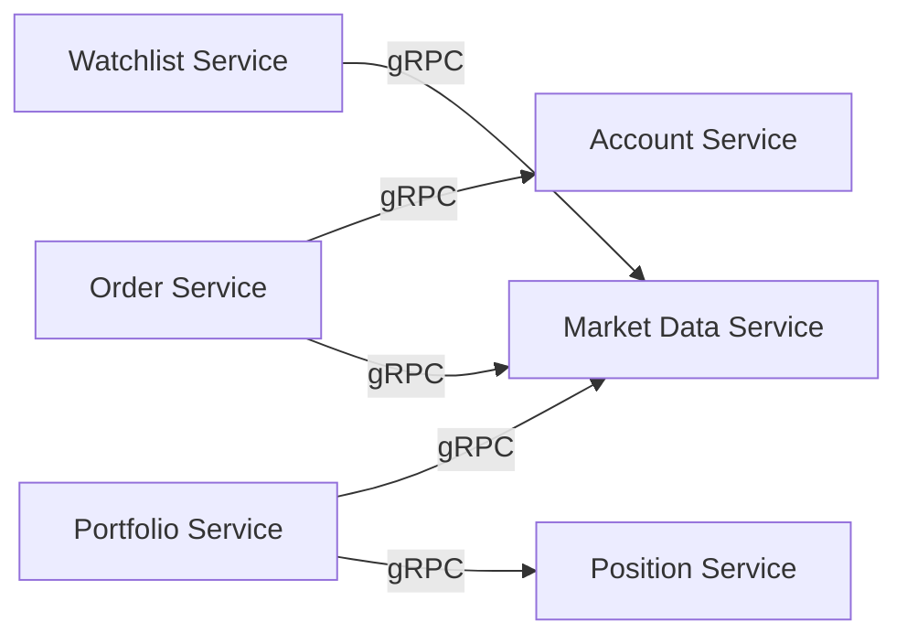
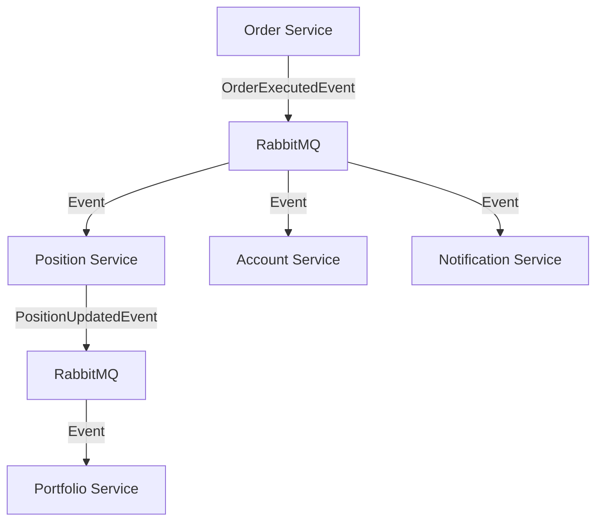
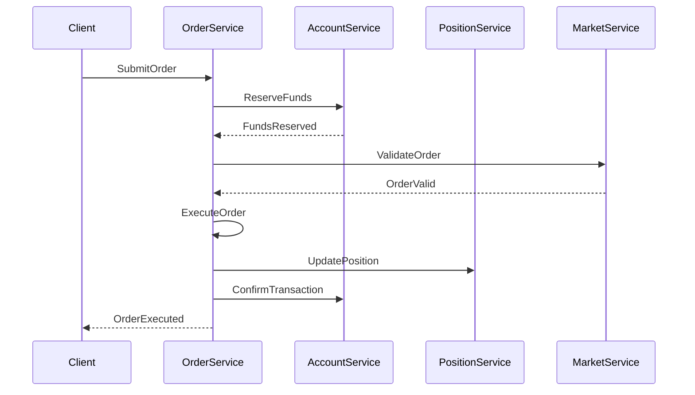

# Hub Investments Microservices Decomposition Strategy

## Executive Summary

This document outlines a comprehensive strategy for decomposing the Hub Investments monolithic application into a microservices architecture. The strategy follows Domain-Driven Design (DDD) principles, ensuring clear business boundaries, data ownership, and scalable inter-service communication.

## Current Architecture Analysis

### Current Monolithic Structure
The existing system is organized into well-defined domain modules:

```
HubInvestmentsServer/
├── internal/
│   ├── auth/                    # Authentication & Authorization
│   ├── login/                   # User Login Management  
│   ├── balance/                 # Account Balance Management
│   ├── market_data/             # Market Data & Asset Information
│   ├── order_mngmt_system/      # Order Lifecycle Management
│   ├── position/                # Position & Portfolio Management
│   ├── portfolio_summary/       # Portfolio Aggregation
│   ├── realtime_quotes/         # Real-time Market Data Streaming
│   └── watchlist/               # User Watchlist Management
├── shared/
│   ├── infra/                   # Shared Infrastructure
│   │   ├── cache/               # Redis Caching
│   │   ├── database/            # Database Connections
│   │   ├── messaging/           # RabbitMQ Messaging
│   │   └── websocket/           # WebSocket Infrastructure
│   └── grpc/                    # Unified gRPC Services
└── pck/                         # Dependency Injection Container
```

### Domain Dependency Analysis

**Current Inter-Domain Dependencies:**
1. **Order Management** → Market Data (price validation, symbol verification)
2. **Order Management** → Position Management (position updates via events)
3. **Position Management** → Market Data (current prices for P&L calculation)
4. **Portfolio Summary** → Position + Balance (aggregation)
5. **Real-time Quotes** → Market Data (price streaming)
6. **All Services** → Auth (authentication & authorization)

## Microservices Decomposition Strategy

### 1. Service Boundaries Definition

Based on business capabilities and data ownership, we identify **6 core microservices**:

#### **Service 1: User Management Service**
**Business Capability:** User authentication, authorization, and profile management
- **Domains:** `auth/`, `login/`
- **Responsibilities:**
  - User registration and authentication
  - JWT token management and validation
  - User profile and preferences
  - Session management
- **Data Ownership:** `users`, `user_sessions`, `user_preferences`
- **API Endpoints:** `/auth/*`, `/users/*`

#### **Service 2: Market Data Service** 
**Business Capability:** Market data provisioning and real-time price feeds
- **Domains:** `market_data/`, `realtime_quotes/`
- **Responsibilities:**
  - Asset master data (symbols, instruments)
  - Real-time and historical price data
  - Market status and trading hours
  - WebSocket price streaming
- **Data Ownership:** `market_data`, `instruments`, `price_history`
- **API Endpoints:** `/market-data/*`, `/quotes/*` (REST + gRPC + WebSocket)

#### **Service 3: Order Management Service**
**Business Capability:** Trade order lifecycle management
- **Domains:** `order_mngmt_system/`
- **Responsibilities:**
  - Order validation and submission
  - Order execution and settlement
  - Order status tracking and history
  - Risk management and compliance
- **Data Ownership:** `orders`, `order_events`, `execution_reports`
- **API Endpoints:** `/orders/*`

#### **Service 4: Position & Portfolio Service**
**Business Capability:** Position management and portfolio aggregation
- **Domains:** `position/`, `portfolio_summary/`
- **Responsibilities:**
  - Position creation and updates
  - Portfolio aggregation and reporting
  - P&L calculations and performance metrics
  - Position reconciliation
- **Data Ownership:** `positions_v2`, `portfolio_snapshots`
- **API Endpoints:** `/positions/*`, `/portfolio/*`

#### **Service 5: Account Management Service**
**Business Capability:** Account balance and financial management
- **Domains:** `balance/`
- **Responsibilities:**
  - Account balance tracking
  - Fund deposits and withdrawals
  - Transaction history
  - Account statements
- **Data Ownership:** `balances`, `transactions`, `account_statements`
- **API Endpoints:** `/accounts/*`, `/balances/*`

#### **Service 6: Watchlist Service**
**Business Capability:** User watchlist and preferences management
- **Domains:** `watchlist/`
- **Responsibilities:**
  - User watchlist management
  - Price alerts and notifications
  - Custom instrument groups
  - User preferences
- **Data Ownership:** `watchlists`, `price_alerts`, `user_preferences`
- **API Endpoints:** `/watchlists/*`

### 2. Service Communication Patterns

#### **Synchronous Communication (gRPC)**
For real-time operations requiring immediate responses:



**gRPC Service Contracts:**
- **MarketDataService:** `GetAssetDetails()`, `ValidateSymbol()`, `GetCurrentPrice()`
- **AccountService:** `CheckBalance()`, `ReserveFunds()`, `ReleaseFunds()`
- **PositionService:** `GetPositions()`, `GetPositionAggregation()`
- **AuthService:** `ValidateToken()`, `GetUserInfo()`

#### **Asynchronous Communication (Event-Driven)**
For eventual consistency and decoupled operations:



**Event Types:**
- `OrderSubmittedEvent`, `OrderExecutedEvent`, `OrderCancelledEvent`
- `PositionCreatedEvent`, `PositionUpdatedEvent`, `PositionClosedEvent`
- `BalanceUpdatedEvent`, `TransactionCompletedEvent`
- `PriceUpdatedEvent`, `MarketStatusChangedEvent`

#### **Hybrid Communication for Portfolio Service**
Portfolio aggregation combines both patterns:
1. **Real-time queries** via gRPC for current state
2. **Event processing** for maintaining aggregated views

### 3. Data Strategy

#### **Database Per Service Pattern**

Each service owns its data and database:

```yaml
User Management Service:
  database: hub_users_db
  schema: users, user_sessions, profiles

Market Data Service:
  database: hub_market_db
  schema: market_data, instruments, price_history

Order Management Service:
  database: hub_orders_db
  schema: orders, order_events, executions

Position & Portfolio Service:
  database: hub_portfolio_db
  schema: positions_v2, portfolio_aggregations

Account Management Service:
  database: hub_accounts_db
  schema: balances, transactions

Watchlist Service:
  database: hub_watchlist_db
  schema: watchlists, alerts, preferences
```

#### **Shared Data Challenges and Solutions**

**Challenge:** User information needed across services
**Solution:** User context propagated via JWT tokens + User service for detailed info

**Challenge:** Asset/instrument master data needed by multiple services
**Solution:** Market Data service as the single source of truth + local caching

**Challenge:** Cross-service transactions (order execution affecting balance + positions)
**Solution:** Saga pattern with compensating actions

### 4. Migration Strategy

#### **Phase 1: Extract Standalone Services (Low Risk)**
**Duration:** 2-3 months
- **Market Data Service** (already has gRPC interface)
- **Watchlist Service** (minimal dependencies)
- **User Management Service** (clear boundaries)

**Migration Steps:**
1. Create separate deployment artifacts
2. Extract databases using database-per-service pattern
3. Update service discovery and configuration
4. Implement health checks and monitoring

#### **Phase 2: Core Business Services (Medium Risk)**  
**Duration:** 3-4 months
- **Account Management Service**
- **Position & Portfolio Service**

**Migration Steps:**
1. Implement event-driven architecture
2. Create data migration scripts for positions_v2
3. Implement distributed transaction patterns
4. Add compensation logic for failures

#### **Phase 3: Complex Orchestration Services (High Risk)**
**Duration:** 4-5 months  
- **Order Management Service**

**Migration Steps:**
1. Implement saga pattern for order execution
2. Create robust event sourcing for order lifecycle
3. Implement circuit breakers for external dependencies
4. Add comprehensive monitoring and alerting

### 5. Technical Architecture

#### **Service Discovery & Configuration**
```yaml
Technology Stack:
  service_discovery: Consul/etcd
  configuration: Consul KV Store
  load_balancing: Envoy Proxy
  api_gateway: Envoy Gateway
```

#### **Inter-Service Communication**
```yaml
Synchronous:
  protocol: gRPC with HTTP/2
  authentication: JWT tokens
  circuit_breaker: Hystrix/resilience4j
  timeout: 5s default, 30s for complex operations

Asynchronous:
  message_broker: RabbitMQ
  event_format: CloudEvents standard
  retry_policy: Exponential backoff (5s, 15s, 1m, 5m)
  dead_letter_queue: Enabled for all services
```

#### **Observability Stack**
```yaml
Monitoring:
  metrics: Prometheus + Grafana
  logging: ELK Stack (Elasticsearch, Logstash, Kibana)
  tracing: Jaeger distributed tracing
  health_checks: HTTP /health endpoints

Alerting:
  tool: AlertManager
  channels: Slack, PagerDuty
  sla_targets: 99.9% uptime, <200ms response time
```

### 6. Deployment Strategy

#### **Containerization**
Each service packaged as Docker container:

```dockerfile
# Example Dockerfile structure
FROM golang:1.21-alpine AS builder
WORKDIR /app
COPY . .
RUN go mod download && go build -o service

FROM alpine:latest
RUN apk add --no-cache ca-certificates
COPY --from=builder /app/service /
EXPOSE 8080 50051
CMD ["./service"]
```

#### **Orchestration**
```yaml
Platform: Kubernetes
Strategy: Blue-Green Deployments
Scaling: Horizontal Pod Autoscaler (HPA)
Resource Limits:
  - CPU: 500m - 2000m
  - Memory: 512Mi - 2Gi
  - Storage: 10Gi persistent volumes
```

#### **Service Mesh**
```yaml
Technology: Istio Service Mesh
Features:
  - Traffic management and routing
  - Security with mTLS
  - Observability and metrics
  - Policy enforcement
```

### 7. Data Consistency Patterns

#### **Eventual Consistency with Saga Pattern**

**Order Execution Saga:**


**Compensation Actions:**
- Order validation failure → Release reserved funds
- Position update failure → Reverse order execution
- Account confirmation failure → Compensate position update

#### **Event Sourcing for Order Service**
```go
// Event Store Pattern
type OrderEvent interface {
    EventID() string
    AggregateID() string
    EventType() string
    Timestamp() time.Time
}

type OrderAggregate struct {
    events []OrderEvent
}

func (a *OrderAggregate) Apply(event OrderEvent) {
    // Apply event to aggregate state
}
```

### 8. Security Architecture

#### **Service-to-Service Authentication**
```yaml
Method: Mutual TLS (mTLS) via Service Mesh
Certificate Management: Cert-Manager with automatic rotation
Token Propagation: JWT tokens with user context
API Rate Limiting: 1000 req/min per service
```

#### **Data Protection**
```yaml
Encryption:
  at_rest: AES-256 database encryption
  in_transit: TLS 1.3 for all communications
  secrets: HashiCorp Vault for secrets management

Access Control:
  authentication: JWT tokens with RS256
  authorization: RBAC with fine-grained permissions
  audit_logging: All API calls logged with user context
```

### 9. Performance and Scalability

#### **Scaling Targets**
```yaml
Order Service:
  throughput: 10,000 orders/minute
  latency: <100ms p95
  availability: 99.9%

Market Data Service:
  concurrent_connections: 50,000 WebSocket
  throughput: 1M price updates/second
  latency: <10ms for price distribution

Position Service:
  aggregation_latency: <200ms p95
  concurrent_portfolio_requests: 1000/second
```

#### **Caching Strategy**
```yaml
L1 Cache: In-memory application cache (Redis)
L2 Cache: CDN for static content (CloudFlare)
Cache Patterns:
  - Write-through for critical data
  - Cache-aside for reference data
  - Refresh-ahead for hot data
TTL Strategy:
  - Market data: 5 seconds
  - User sessions: 30 minutes
  - Reference data: 1 hour
```

### 10. Operational Excellence

#### **Monitoring and Alerting**
```yaml
SLIs (Service Level Indicators):
  - Request latency (p50, p95, p99)
  - Error rate (4xx, 5xx responses)
  - Throughput (requests per second)
  - Availability (uptime percentage)

SLOs (Service Level Objectives):
  - 99.9% availability
  - <200ms p95 latency
  - <1% error rate
  - <5s deployment time

Alerts:
  - Critical: Page immediately (P0)
  - Warning: Notify team (P1)
  - Info: Dashboard only (P2)
```

#### **Disaster Recovery**
```yaml
Backup Strategy:
  frequency: Every 6 hours
  retention: 30 days
  cross_region: Enabled

Recovery Targets:
  RTO (Recovery Time Objective): 4 hours
  RPO (Recovery Point Objective): 1 hour

Failover:
  automatic: For infrastructure failures
  manual: For data corruption scenarios
```

### 11. Implementation Roadmap

#### **Quarter 1: Foundation (Months 1-3)**
- [ ] Set up Kubernetes cluster and service mesh
- [ ] Implement monitoring and observability stack
- [ ] Extract Market Data Service
- [ ] Extract User Management Service
- [ ] Implement basic gRPC communication

#### **Quarter 2: Core Services (Months 4-6)**
- [ ] Extract Watchlist Service
- [ ] Extract Account Management Service
- [ ] Implement event-driven architecture
- [ ] Add circuit breakers and resilience patterns

#### **Quarter 3: Complex Services (Months 7-9)**
- [ ] Extract Position & Portfolio Service
- [ ] Implement saga pattern for distributed transactions
- [ ] Add comprehensive testing (contract, integration, E2E)
- [ ] Performance optimization and load testing

#### **Quarter 4: Advanced Features (Months 10-12)**
- [ ] Extract Order Management Service
- [ ] Implement event sourcing
- [ ] Add advanced monitoring and analytics
- [ ] Security hardening and compliance

### 12. Success Metrics

#### **Technical Metrics**
- **Deployment Frequency:** Daily deployments per service
- **Lead Time:** <2 hours from commit to production
- **Mean Time to Recovery:** <30 minutes
- **Change Failure Rate:** <5%

#### **Business Metrics**
- **System Availability:** 99.9%+ uptime
- **Order Processing:** 10,000+ orders/minute capacity
- **User Experience:** <200ms API response times
- **Cost Efficiency:** 30% reduction in infrastructure costs through better resource utilization

### 13. Risk Mitigation

#### **Technical Risks**
- **Data Consistency Issues:** Implement robust saga patterns with compensation
- **Network Partitions:** Design for eventual consistency
- **Service Dependencies:** Implement circuit breakers and fallbacks
- **Data Migration:** Extensive testing and rollback procedures

#### **Operational Risks**
- **Team Knowledge:** Cross-training and documentation
- **Deployment Complexity:** Automated CI/CD pipelines
- **Monitoring Gaps:** Comprehensive observability from day one
- **Security Vulnerabilities:** Regular security audits and penetration testing

## Conclusion

This microservices decomposition strategy provides a clear roadmap for transforming the Hub Investments monolithic application into a scalable, resilient, and maintainable microservices architecture. The approach balances business value delivery with technical excellence, ensuring a smooth transition while maintaining system reliability and performance.

The strategy emphasizes:
- **Domain-driven boundaries** for clear service ownership
- **Event-driven architecture** for loose coupling
- **Comprehensive observability** for operational excellence
- **Incremental migration** for reduced risk
- **Performance and scalability** for business growth

By following this strategy, the Hub Investments platform will be well-positioned for future scale, feature development, and market expansion.
