# HubInvestments System Architecture Diagrams

This document contains the Mermaid diagram code for the HubInvestments system architecture diagrams.

## Diagram 0: Simple Order Processing Flow

**Clean, linear flow showing the core order processing logic:**


## Diagram 0.1: Simple Microservices Overview

**Clean, organized view of the microservices architecture:**

```mermaid
graph TB
    %% Client Layer
    WebApp[Web Application<br/>React/Angular]:::client
    MobileApp[Mobile App<br/>iOS/Android]:::client
    
    %% API Gateway
    Gateway[API Gateway<br/>Kong/Nginx<br/>Port 443]:::gateway
    
    %% Core Services Row 1
    AuthSvc[🔐 Auth Service<br/>Port 8001]:::service
    LoginSvc[👤 Login Service<br/>Port 8002]:::service
    BalanceSvc[💰 Balance Service<br/>Port 8003]:::service
    
    %% Core Services Row 2
    PositionSvc[📊 Position Service<br/>Port 8004]:::service
    PortfolioSvc[📈 Portfolio Service<br/>Port 8005]:::service
    MarketSvc[📉 Market Data Service<br/>Port 8006]:::service
    
    %% Core Services Row 3
    WatchlistSvc[⭐ Watchlist Service<br/>Port 8007]:::service
    OrderSvc[🛒 Order Service<br/>Port 8008]:::service
    
    %% Infrastructure
    MessageQueue[RabbitMQ<br/>Message Broker]:::infra
    Cache[Redis<br/>Cache Cluster]:::infra
    Database[(PostgreSQL<br/>Database Cluster)]:::database
    
    %% External
    Broker[External Broker<br/>Order Execution]:::external
    MarketData[Market Data Provider<br/>Real-time Feeds]:::external
    
    %% Client Connections
    WebApp --> Gateway
    MobileApp --> Gateway
    
    %% Gateway to Services
    Gateway --> AuthSvc
    Gateway --> LoginSvc
    Gateway --> BalanceSvc
    Gateway --> PositionSvc
    Gateway --> PortfolioSvc
    Gateway --> MarketSvc
    Gateway --> WatchlistSvc
    Gateway --> OrderSvc
    
    %% Service Dependencies
    PortfolioSvc -.-> PositionSvc
    PortfolioSvc -.-> BalanceSvc
    OrderSvc -.-> MarketSvc
    WatchlistSvc -.-> MarketSvc
    
    %% Infrastructure Connections
    OrderSvc --> MessageQueue
    MarketSvc --> Cache
    AuthSvc --> Cache
    
    %% Database Connections
    AuthSvc --> Database
    LoginSvc --> Database
    BalanceSvc --> Database
    PositionSvc --> Database
    PortfolioSvc --> Database
    MarketSvc --> Database
    WatchlistSvc --> Database
    OrderSvc --> Database
    
    %% External Connections
    OrderSvc --> Broker
    MarketSvc --> MarketData
    
    %% CSS Classes
    classDef client fill:#E3F2FD,stroke:#1976D2,stroke-width:2px,color:#000
    classDef gateway fill:#FFF3E0,stroke:#FF9800,stroke-width:3px,color:#000
    classDef service fill:#4A90E2,stroke:#2E5C8A,stroke-width:2px,color:#fff
    classDef infra fill:#9C27B0,stroke:#7B1FA2,stroke-width:2px,color:#fff
    classDef database fill:#4CAF50,stroke:#388E3C,stroke-width:2px,color:#fff
    classDef external fill:#FF5722,stroke:#D84315,stroke-width:2px,color:#fff
```



## Diagram 1: Current Implementation Status (Color-Coded)

**Legend:**
- 🔵 Blue: Fully implemented and working components
- 🔴 Red: Not implemented yet (planned in TODO.md)
- 🟠 Orange: Partially implemented (domain logic exists but missing infrastructure)


## Diagram 2: Future Microservices Architecture

**Legend:**
- 🔵 Blue: Services that can be extracted from current implementation
- 🟠 Orange: Services that need completion before extraction
- 🟣 Purple: Infrastructure components
- 🟢 Green: Database services
- 🔴 Red: External services
- 📊 Gray: Monitoring and observability
- 🛡️ Red: Security services

```mermaid
graph TB
    %% External Clients
    WebClient[Web Client]:::client
    MobileClient[Mobile Client]:::client
    AdminClient[Admin Client]:::client
    
    %% API Gateway & Load Balancer
    APIGateway[API Gateway<br/>Kong/Nginx<br/>Port: 443/80<br/>Authentication<br/>Rate Limiting<br/>Load Balancing<br/>SSL Termination]:::gateway
    
    %% Service Discovery & Configuration
    ServiceDiscovery[Service Discovery<br/>Consul/Eureka<br/>Service Registration<br/>Health Checks<br/>Configuration Management]:::infrastructure
    
    %% Authentication Microservice
    AuthService[🔐 Authentication Service<br/>Port: 8001<br/>JWT Token Management<br/>User Authentication<br/>Token Validation<br/>Session Management]:::implemented
    
    %% Login Microservice  
    LoginService[👤 Login Service<br/>Port: 8002<br/>User Login Logic<br/>Password Validation<br/>Account Verification<br/>Login Audit]:::implemented
    
    %% Balance Microservice
    BalanceService[💰 Balance Service<br/>Port: 8003<br/>Account Balance Management<br/>Balance Calculations<br/>Transaction History<br/>Balance Validation]:::implemented
    
    %% Position Microservice
    PositionService[📊 Position Service<br/>Port: 8004<br/>Asset Position Tracking<br/>Position Aggregation<br/>Portfolio Calculations<br/>Asset Management]:::implemented
    
    %% Portfolio Summary Microservice
    PortfolioService[📈 Portfolio Service<br/>Port: 8005<br/>Portfolio Aggregation<br/>Cross-Service Orchestration<br/>Portfolio Analytics<br/>Performance Metrics]:::implemented
    
    %% Market Data Microservice
    MarketDataService[📉 Market Data Service<br/>Port: 8006 HTTP<br/>Port: 50051 gRPC<br/>Real-time Market Data<br/>Price Information<br/>Market Analytics<br/>Data Caching]:::implemented
    
    %% Watchlist Microservice
    WatchlistService[⭐ Watchlist Service<br/>Port: 8007<br/>User Watchlists<br/>Symbol Tracking<br/>Watchlist Management<br/>Notifications]:::implemented
    
    %% Order Management Microservice
    OrderService[🛒 Order Management Service<br/>Port: 8008<br/>Order Processing<br/>Order Validation<br/>Risk Management<br/>Order Execution<br/>Order History]:::partiallyImplemented
    
    %% Message Queue Cluster
    MessageBroker[📨 Message Broker Cluster<br/>RabbitMQ/Apache Kafka<br/>Order Processing Queues<br/>Event Streaming<br/>Dead Letter Queues<br/>Message Persistence]:::infrastructure
    
    %% Cache Cluster
    CacheCluster[⚡ Cache Cluster<br/>Redis Cluster<br/>Distributed Caching<br/>Session Storage<br/>Market Data Cache<br/>High Availability]:::infrastructure
    
    %% Database Cluster
    DatabaseCluster[🗄️ Database Cluster<br/>PostgreSQL Cluster<br/>Master-Slave Replication<br/>Connection Pooling<br/>Backup & Recovery<br/>Data Partitioning]:::infrastructure
    
    %% Individual Service Databases
    AuthDB[(Auth Database<br/>Users & Sessions)]:::database
    LoginDB[(Login Database<br/>Authentication Data)]:::database
    BalanceDB[(Balance Database<br/>Account Balances)]:::database
    PositionDB[(Position Database<br/>Asset Positions)]:::database
    MarketDataDB[(Market Data Database<br/>Price & Market Info)]:::database
    WatchlistDB[(Watchlist Database<br/>User Watchlists)]:::database
    OrderDB[(Order Database<br/>Orders & Transactions)]:::database
    
    %% External Services
    ExternalBroker[🏦 External Broker API<br/>Order Execution<br/>Settlement<br/>Clearing]:::external
    MarketDataProvider[📊 Market Data Provider<br/>Real-time Feeds<br/>Historical Data<br/>Market Events]:::external
    
    %% Monitoring & Observability
    MonitoringStack[📊 Monitoring Stack<br/>Prometheus + Grafana<br/>Metrics Collection<br/>Alerting<br/>Dashboards<br/>Performance Monitoring]:::monitoring
    
    LoggingStack[📝 Logging Stack<br/>ELK Stack<br/>Centralized Logging<br/>Log Aggregation<br/>Search & Analytics<br/>Audit Trails]:::monitoring
    
    TracingSystem[🔍 Distributed Tracing<br/>Jaeger/Zipkin<br/>Request Tracing<br/>Performance Analysis<br/>Dependency Mapping<br/>Bottleneck Detection]:::monitoring
    
    %% Security Services
    SecurityService[🛡️ Security Service<br/>WAF Protection<br/>DDoS Mitigation<br/>Security Headers<br/>Threat Detection]:::security
    
    %% Client Connections
    WebClient --> APIGateway
    MobileClient --> APIGateway
    AdminClient --> APIGateway
    
    %% API Gateway Routing
    APIGateway --> AuthService
    APIGateway --> LoginService
    APIGateway --> BalanceService
    APIGateway --> PositionService
    APIGateway --> PortfolioService
    APIGateway --> MarketDataService
    APIGateway --> WatchlistService
    APIGateway --> OrderService
    
    %% Service Discovery Integration
    ServiceDiscovery --> AuthService
    ServiceDiscovery --> LoginService
    ServiceDiscovery --> BalanceService
    ServiceDiscovery --> PositionService
    ServiceDiscovery --> PortfolioService
    ServiceDiscovery --> MarketDataService
    ServiceDiscovery --> WatchlistService
    ServiceDiscovery --> OrderService
    
    %% Inter-Service Communication gRPC/HTTP
    PortfolioService -.->|gRPC| PositionService
    PortfolioService -.->|gRPC| BalanceService
    WatchlistService -.->|gRPC| MarketDataService
    OrderService -.->|gRPC| MarketDataService
    OrderService -.->|gRPC| BalanceService
    OrderService -.->|gRPC| PositionService
    
    %% Authentication Flow
    APIGateway -.->|Token Validation| AuthService
    LoginService -.->|Token Generation| AuthService
    
    %% Message Queue Integration
    OrderService --> MessageBroker
    MessageBroker --> OrderService
    
    %% Cache Integration
    MarketDataService --> CacheCluster
    AuthService --> CacheCluster
    PortfolioService --> CacheCluster
    
    %% Database Connections
    AuthService --> DatabaseCluster
    LoginService --> DatabaseCluster
    BalanceService --> DatabaseCluster
    PositionService --> DatabaseCluster
    MarketDataService --> DatabaseCluster
    WatchlistService --> DatabaseCluster
    OrderService --> DatabaseCluster
    
    %% Individual Database Mapping
    DatabaseCluster --> AuthDB
    DatabaseCluster --> LoginDB
    DatabaseCluster --> BalanceDB
    DatabaseCluster --> PositionDB
    DatabaseCluster --> MarketDataDB
    DatabaseCluster --> WatchlistDB
    DatabaseCluster --> OrderDB
    
    %% External Service Integration
    OrderService --> ExternalBroker
    MarketDataService --> MarketDataProvider
    
    %% Security Integration
    APIGateway --> SecurityService
    
    %% Monitoring Integration
    AuthService --> MonitoringStack
    LoginService --> MonitoringStack
    BalanceService --> MonitoringStack
    PositionService --> MonitoringStack
    PortfolioService --> MonitoringStack
    MarketDataService --> MonitoringStack
    WatchlistService --> MonitoringStack
    OrderService --> MonitoringStack
    
    %% Logging Integration
    AuthService --> LoggingStack
    LoginService --> LoggingStack
    BalanceService --> LoggingStack
    PositionService --> LoggingStack
    PortfolioService --> LoggingStack
    MarketDataService --> LoggingStack
    WatchlistService --> LoggingStack
    OrderService --> LoggingStack
    
    %% Tracing Integration
    AuthService --> TracingSystem
    LoginService --> TracingSystem
    BalanceService --> TracingSystem
    PositionService --> TracingSystem
    PortfolioService --> TracingSystem
    MarketDataService --> TracingSystem
    WatchlistService --> TracingSystem
    OrderService --> TracingSystem
    
    %% CSS Classes for Microservices Architecture
    classDef client fill:#E8F4FD,stroke:#1E88E5,stroke-width:2px,color:#000
    classDef gateway fill:#FFF3E0,stroke:#FF9800,stroke-width:3px,color:#000
    classDef implemented fill:#4A90E2,stroke:#2E5C8A,stroke-width:2px,color:#fff
    classDef partiallyImplemented fill:#F39C12,stroke:#D68910,stroke-width:2px,color:#fff
    classDef infrastructure fill:#9C27B0,stroke:#7B1FA2,stroke-width:2px,color:#fff
    classDef database fill:#4CAF50,stroke:#388E3C,stroke-width:2px,color:#fff
    classDef external fill:#FF5722,stroke:#D84315,stroke-width:2px,color:#fff
    classDef monitoring fill:#607D8B,stroke:#455A64,stroke-width:2px,color:#fff
    classDef security fill:#F44336,stroke:#C62828,stroke-width:2px,color:#fff
```



## How to Convert to Images

To convert these Mermaid diagrams to PNG/JPEG images, you can use:

1. **Online Tools:**
   - [Mermaid Live Editor](https://mermaid.live/) - Paste the code and export as PNG/SVG
   - [Mermaid Ink](https://mermaid.ink/) - URL-based image generation

2. **CLI Tools:**
   ```bash
   npm install -g @mermaid-js/mermaid-cli
   mmdc -i diagram.mmd -o diagram.png
   ```

3. **VS Code Extensions:**
   - Mermaid Preview extension
   - Export functionality available

4. **GitHub/GitLab:**
   - Both platforms render Mermaid diagrams natively in markdown files

## Architecture Migration Strategy

### Phase 1: Extract Independent Services
1. **Market Data Service** - Already has gRPC interface
2. **Authentication Service** - Stateless, easy to extract
3. **Balance Service** - Simple CRUD operations
4. **Position Service** - Independent business logic

### Phase 2: Extract Orchestration Services
1. **Portfolio Service** - Depends on Position and Balance services
2. **Watchlist Service** - Depends on Market Data service

### Phase 3: Complete and Extract Complex Services
1. **Order Management Service** - Complete implementation first
2. **Login Service** - Extract after user registration is implemented

### Phase 4: Add Infrastructure
1. **API Gateway** - Kong or Nginx
2. **Service Discovery** - Consul or Eureka
3. **Monitoring Stack** - Prometheus + Grafana
4. **Logging Stack** - ELK Stack
5. **Distributed Tracing** - Jaeger or Zipkin
